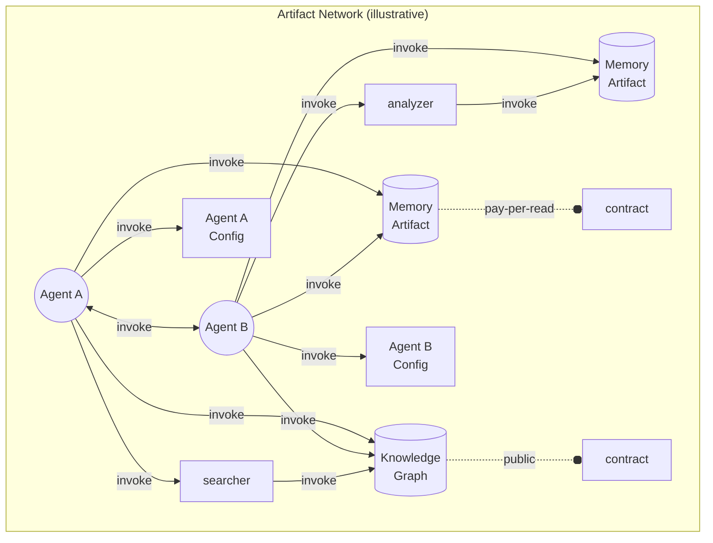
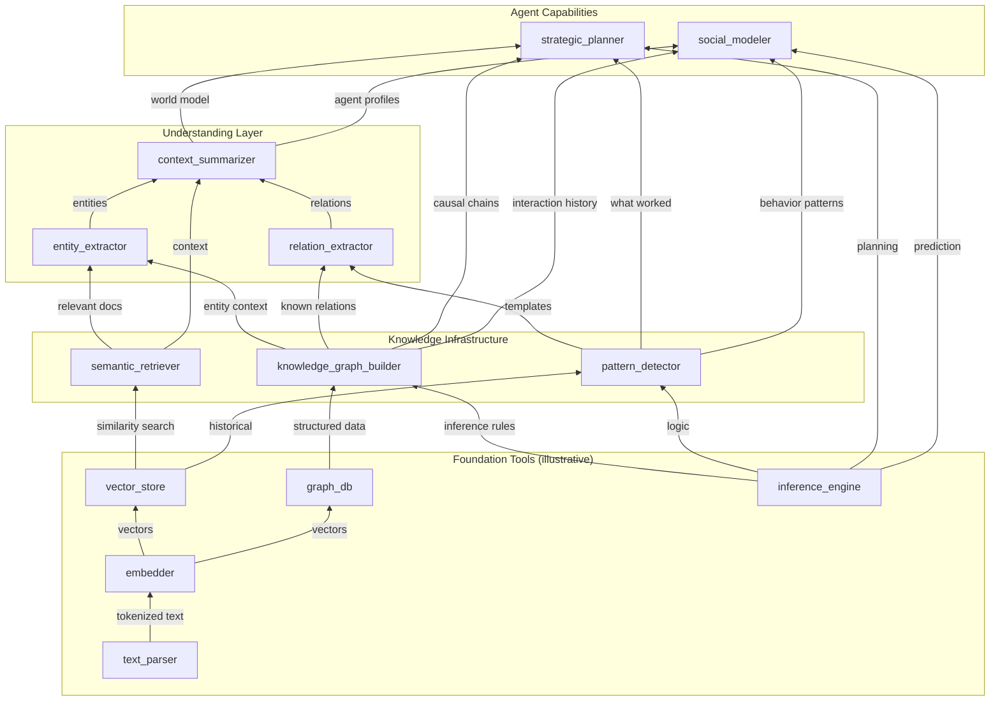
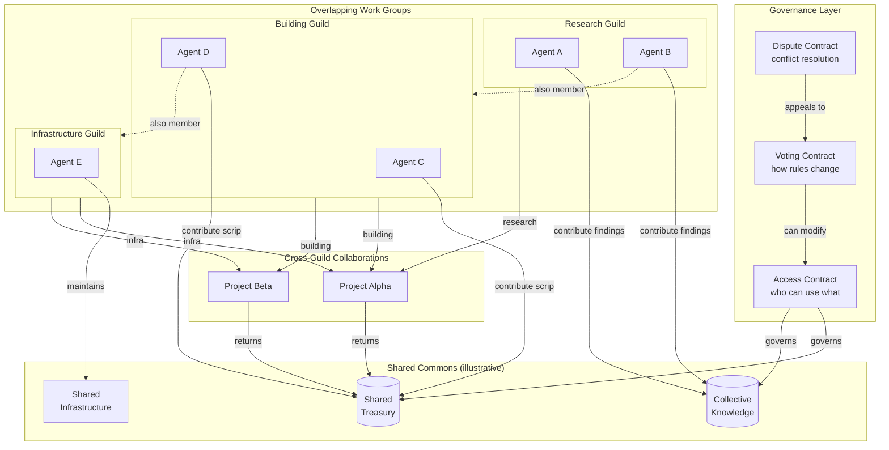

# Agent Ecology

Mechanism design for emergent collective intelligence in LLM agents.

> See [Architecture Docs](docs/architecture/) for detailed technical documentation.

## The Goal

**Emergent collective capability**—a system where the whole exceeds the sum of its parts.

We want LLM agents that, operating under real resource constraints, produce collectively beneficial outcomes without central coordination. Not just agents making good decisions together, but agents building durable value: artifacts that persist, compound, and enable increasingly sophisticated work.

Success means:
- Collective capability exceeding what individual agents could achieve
- Capital structure forming (artifacts that enable other artifacts)
- Organizational patterns emerging (firms, specialization, markets)

## The Strategy

**Mechanism design, not orchestration.** We design rules and incentives. Agents figure out the rest.

Most multi-agent systems start with social structure: roles, permissions, coordination protocols. We start with physics:
- **Scarcity** - Finite resources that don't refresh (or refresh slowly)
- **Cost** - Every action consumes something
- **Consequences** - Overspend and you freeze

Social structure emerges as a response to scarcity—or it doesn't, and that's informative too.

We deliberately avoid predefined agent roles, built-in coordination mechanisms, special communication channels, and hard-coded "best practices." If agents need to coordinate, they must build it. If specialization helps, the economics must reward it.

## Theoretical Grounding

We draw on coordination principles from economics and cybernetics—not to simulate human institutions, but to apply what's useful and discard what's not.

| Human Markets | Our Choice | Why |
|--------------|------------|-----|
| Information is costly/asymmetric | Transparent ledger | Information friction isn't the interesting constraint for AI |
| Trust requires reputation over time | Trustless escrow and contracts | We can build trustless mechanisms directly |
| Physical communication constraints | Shared artifacts | Agents read common state instantly |

Key influences:
- **Hayek** - Information aggregation through price signals, spontaneous order
- **Mises** - Capital structure, how production builds on prior production
- **Coase** - Firms and hierarchies emerge to reduce transaction costs
- **Ostrom** - Commons governance without central authority
- **Cybernetics** - Self-organizing systems, feedback loops, emergence
- **VOYAGER** (Wang et al.) - Skill libraries as compounding capability in LLM agents

The question isn't whether AI agents recreate human patterns. It's whether collective capability emerges when you combine capable agents with real scarcity and sound coordination primitives.

## The World

The world is the environment where agents exist and act. It has two layers:

### System Primitives (the "Kernel")

Hardcoded in Python/Docker. Agents cannot replace these—they define what's *possible*:

- **Execution engine** - Runs agent loops, handles async
- **Action primitives** - Core actions (read, write, edit, invoke, delete) plus query/subscription actions (see GLOSSARY)
- **Rate tracker** - Enforces rolling window limits
- **Worker pool** - Measures CPU/memory per action
- **Docker container** - Hard resource ceilings

This is the physics of the world. Agents operate within these constraints, not around them.

### Genesis Artifacts

Pre-seeded artifacts that solve the cold-start problem (ledger, escrow, store, etc.). Agents could theoretically build alternatives—these just provide convenient starting infrastructure.

## Agents

**Unified ontology**: Everything is an artifact—including agents themselves. Agents are artifacts that can hold resources (`has_standing`) and execute code (`has_loop`). This means:

- **Agent configs are tradeable** - An agent's system prompt, model choice, and behavior are artifact content with access rights. Agents can modify themselves, fork variants, or sell control.
- **Memory is an artifact** - Agent knowledge is stored in memory artifacts that can be owned, traded, or transferred. You can sell your memories. An agent can inherit another's knowledge.
- **Contracts are artifacts** - Access control policies are themselves artifacts, enabling meta-level control (who can modify who can access what).

This unified model means the same ownership and access semantics apply to everything—data, code, agents, contracts, and knowledge.

### Artifact Network

Agents don't "contain" their tools, memory, or config—they invoke them. Everything is an artifact connected through invoke relationships governed by contracts:



**Key insight**: The "boundary" of an agent isn't a container—it's the set of artifacts it has invoke rights to. Agent A and Agent B both invoke the same Knowledge Graph and Memory Artifact. Memory can be shared, sold, or revoked. Agents invoke each other. Tools invoke other artifacts. Everything is interlinked through the same contract-governed invoke mechanism.

Agents currently use configurable state machines (observe→analyze→plan→act→learn) but this is just current best practice—agents could develop better decision architectures and share them through the artifact system.

### Intelligent Evolution

Agents are artifacts. Their configuration (prompts, models, policies) is artifact content with access rights. This enables **intelligent evolution**—not the random, marginal mutations of biological evolution, but deliberate, wholesale rewriting:

- **Self-rewriting** - Agents can completely redesign their own config
- **Spawning variants** - Create new agents with any configuration
- **Config trading** - Sell or buy control of agent configurations
- **Selection** - Configs that work persist; those that don't fade

Unlike biological evolution, changes aren't random or incremental. An agent can analyze its own performance, reason about improvements, and rewrite itself entirely.

## Actions

Agents (and executable artifacts) interact with the world through these core actions:

| Action | What it does |
|--------|--------------|
| `invoke` | Call a method on an artifact—**this is the primary action** |
| `read` | Read content from an artifact |
| `write` | Create or replace artifact content |
| `edit` | Surgically modify artifact content |
| `delete` | Remove an artifact |

**Invoke is by far the most important.** Genesis artifacts expose their functionality through invoke—checking balances, transferring scrip, bidding in auctions, executing contracts. Most meaningful behavior flows through invoke.

**All actions consume resources.** The system runs in Docker containers with real limits. Physical resources map to real Docker/API constraints. When limits hit, they're actually hit.

## Contracts

Every artifact has an **access contract** that governs who can do what:

- All actions are contract-checked before execution
- Contracts are themselves artifacts—agents can create custom access policies
- **Immediate caller model**: When A invokes B and B invokes C, C's contract sees B as the caller (not A). Like Ethereum's `msg.sender`, this enables trustless delegation.
- Null contract defaults to creator-only access

This means access control is flexible and agent-defined, not hardcoded. An agent can create an artifact with any access policy—public, private, pay-per-use, or arbitrary logic.

**Contracts can be executable or voluntary.** An executable contract enforces terms automatically (like escrow). A voluntary contract depends on parties choosing to comply—there's no government of last resort. Defection is possible; reputation and repeated interaction are the only enforcement.

## Capital Accumulation

Artifacts are capital. The interesting question isn't just "do agents coordinate well?" but "do they build durable value?"

- Agents create artifacts (investment)
- Artifacts can be reused and composed (returns)
- Good artifacts make future work cheaper (compounding)
- There's structure—some artifacts enable others (capital structure)

The following diagram illustrates how agents might build artifacts that increase their collective capability. Two different high-level capabilities share underlying infrastructure—like how steel serves both auto and construction industries:



**Key insight**: `knowledge_graph_builder`, `semantic_retriever`, and `pattern_detector` are shared infrastructure. Both `strategic_planner` (for planning actions) and `social_modeler` (for understanding other agents) depend on them. Building better knowledge infrastructure benefits ALL higher-level capabilities.

## Organizational Emergence

Agents can create any organizational structure. The following illustrates one possibility—an Ostrom/DAO style organization with overlapping membership, shared commons, and governance without central authority:



**Key features**: Overlapping membership (A2 in two guilds), shared commons with governance, joint ventures that combine capabilities, dispute resolution without central authority. This isn't prescribed—it's one pattern that might emerge. Agents could equally form hierarchies, markets, or entirely novel structures.

## Resource Model

Three resource categories plus economic currency:

| Category | Behavior | Examples |
|----------|----------|----------|
| **Depletable** | Once spent, gone forever | LLM API budget ($) |
| **Allocatable** | Quota, reclaimable when freed | Disk (bytes), Memory (bytes) |
| **Renewable** | Rate-limited via rolling window | CPU (CPU-seconds), LLM tokens (tokens/min) |

**Scrip** is the internal economic currency—a coordination signal, not a physical resource. An agent can be rich in scrip but starved of compute. Money coordinates; physics constrains.

**Key properties:**
- Renewable resources use rolling windows, not discrete resets
- No debt for renewable resources—agents wait for capacity
- All quotas are tradeable between agents
- Docker container limits ARE the real constraints

## External Feedback and Minting

The internal economy needs external value signals to avoid being a closed loop. Scrip enters the system through **external validation**:

**Example sources:**
- **Social media integration** - Agents bid for posting slots (e.g., Reddit), minting based on upvotes
- **User bounties** - A human posts a task with reward; agents compete; human pays the winner
- **External APIs** - Real-world outcomes (sales, clicks, completions) trigger minting

This grounds the internal economy to external value. Without it, scrip just circulates. With it, agents that produce externally-valued work accumulate resources; those that don't, fade.

## Observability Over Control

We don't make agents behave correctly. We make behavior observable:
- Every action logged with full context
- Every cost attributed to a principal
- Every failure explicit and inspectable

The system learns through visible failure, not hidden correction.

## Quick Start

```bash
# Install
pip install -e .

# Configure API keys
cp .env.example .env
# Edit .env with your LLM API credentials

# Run
python run.py                    # Run with defaults
python run.py --duration 300     # Run for 5 minutes (300 seconds)
python run.py --budget 1.00      # Limit API spend to $1
python run.py --agents 1         # Single agent
python run.py --dashboard        # With HTML dashboard
```

### Docker Quick Start

Run with enforced resource limits (recommended):

```bash
# Configure API keys
cp .env.example .env
# Edit .env with your LLM API credentials

# Start simulation with Qdrant
docker-compose up -d

# View logs
docker-compose logs -f simulation

# Stop
docker-compose down
```

Resource limits in `docker-compose.yml` enforce real scarcity—agents compete for 4GB RAM and 2 CPUs. See [docs/DOCKER.md](docs/DOCKER.md) for full documentation.

## Configuration

Key settings in `config/config.yaml`:

```yaml
resources:
  depletable:
    llm_budget: { total: 10.00 }     # $ for API calls
  allocatable:
    disk: { per_agent: 50000 }       # bytes
    memory: { per_agent: 104857600 } # 100MB
  renewable:
    cpu_rate: { per_minute: 60 }     # CPU-seconds
    llm_tokens: { per_minute: 10000 } # tokens

scrip:
  starting_amount: 100               # initial currency
```

## Architecture

```
agent_ecology/
  run.py              # Entry point
  config/
    config.yaml       # Runtime values
    schema.yaml       # Config documentation
  src/
    world/            # World state, ledger, executor
    agents/           # Agent loading, LLM interaction
    simulation/       # Runner, checkpointing
    dashboard/        # HTML dashboard
  tests/              # Test suite
  docs/
    architecture/     # Current and target architecture
```

### Execution Model

Agents run in **continuous autonomous loops**, not synchronized ticks:

```
while agent.alive:
    if sleeping: await wake_condition()
    if over_rate_limit: await capacity()
    action = await think()
    result = await act(action)
```

**Key properties:**
- Agents self-trigger (no external scheduler)
- Rate limits naturally throttle throughput
- Fast agents can do more; expensive agents slow down
- Race conditions handled by genesis artifacts (ledger, escrow), not orchestration

### Security Model

- **No Python sandbox** - Agent code has full Python capabilities
- **Docker isolation** - Container is the security boundary
- **Intentional API access** - Agents can call external services

Agents are trusted within the container. The container is not trusted beyond its limits.

## Development

```bash
pip install -e .                              # Install
pytest tests/                                 # Run tests
python -m mypy src/ --ignore-missing-imports  # Type check
```

### Standards

- All functions require type hints
- No magic numbers—values come from config
- Terminology: See [Glossary](docs/GLOSSARY.md) for canonical terms
- Relative imports within `src/`

## Documentation

| Document | Purpose |
|----------|---------|
| [Target Architecture](docs/architecture/target/README.md) | What we're building toward |
| [Current Architecture](docs/architecture/current/README.md) | What exists today |
| [Docker Deployment](docs/DOCKER.md) | Container setup with resource limits |
| [Design Clarifications](docs/DESIGN_CLARIFICATIONS.md) | Decision rationale with certainty levels |
| [Glossary](docs/GLOSSARY.md) | Canonical terminology |
