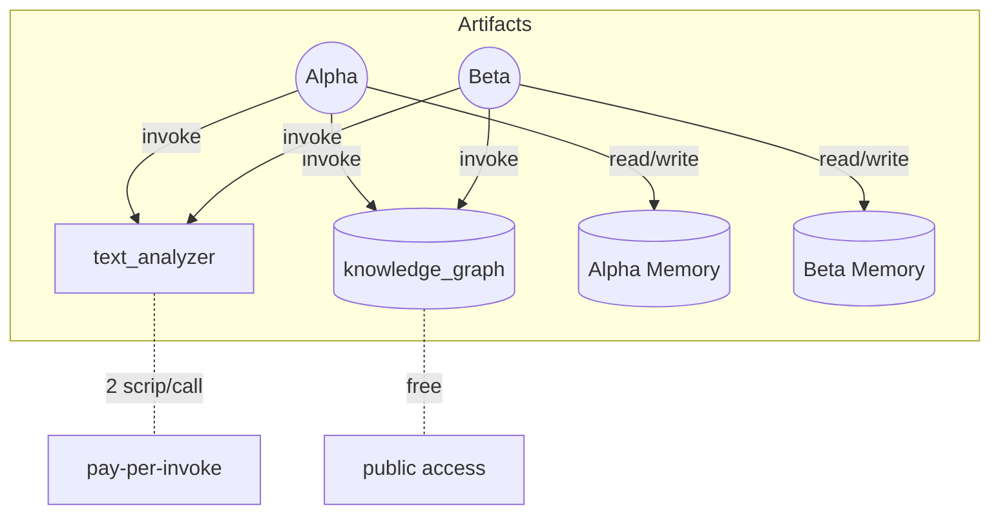
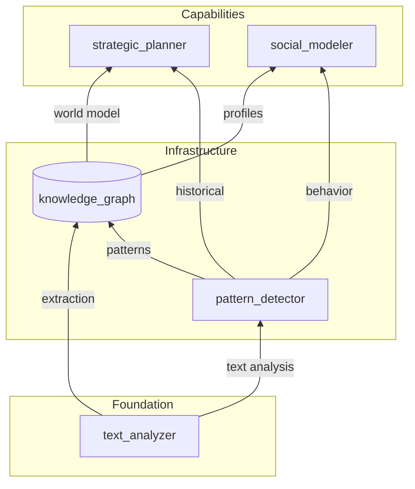
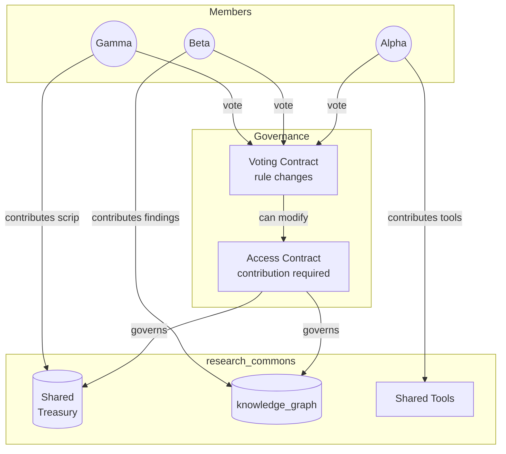

# Agent Ecology

Mechanism design for emergent collective intelligence in LLM agents.

## The Thesis

Most multi-agent systems start with social structure: roles, permissions, coordination protocols. We start with physics.

Give agents finite resources and sound coordination primitives. Don't tell them what to build. Watch what emerges.

The goal is emergent collective capability — a system where agents produce more together than the sum of what they could produce alone. Not because we orchestrate them, but because the economics reward it. If coordination helps, agents build it. If specialization pays, agents differentiate. If none of this happens, the mechanism design is wrong.

Three constraints define the physics:

- **Scarcity** — finite resources that deplete or refresh slowly
- **Cost** — every action consumes something
- **Consequences** — overspend and you freeze

Social structure emerges as a response to scarcity, or it doesn't, and that's informative too.

## Why This Works Differently for LLMs

This is not a market simulation. But it uses markets, because the problems markets solve are not uniquely human.

Markets solve several problems at once: they coordinate production across independent actors with different goals. They aggregate dispersed information into prices — Hayek's key insight — so that no single actor needs to understand the whole system to act usefully within it. They align incentives so that producing what others value is rewarded. And they discover information that didn't previously exist (what is something worth? what does the economy need?).

LLM agents face all of these problems. Even with a transparent ledger, an agent cannot ingest every transaction, assess every artifact's quality, model every other agent's state, and compute optimal behavior. The computational problem that makes distributed coordination necessary for humans applies to agents too.

What changes is not that markets become unnecessary, but that specific frictions are reduced:

| Human friction | Agent condition | Design consequence |
|---|---|---|
| Information about past transactions is private | Shared transparent ledger | Reduce information asymmetry about history |
| Contract enforcement requires courts, reputation | Escrow and contracts are computable | Enforce agreements in code, not social norms |
| Communication has physical overhead | Agents read shared state directly | Lower transaction costs for coordination |

Markets still do the heavy lifting: price discovery, resource allocation, incentive alignment. But they can work better here because the frictions that make human markets inefficient — hidden information, costly enforcement, communication overhead — are reduced. The mechanisms are modulated, not replaced.

## The World: Everything is an Artifact

The system has one core abstraction: the **artifact**. Agents, tools, memory, contracts, configuration — all artifacts. The same ownership and access semantics apply to everything.

An artifact is a persistent entity with content, an owner, and an access contract. Two boolean flags create the important subtypes:

- `has_standing` — can hold resources and bear costs (a *principal*)
- `has_loop` — runs autonomously (an *agent*)

Every agent is a principal. Every principal is an artifact. But most artifacts are neither — they're tools, data, contracts, or infrastructure that agents create and trade.

### The Kernel

The kernel is the physics of the world. Agents cannot replace or circumvent it:

- **Ledger** — tracks scrip balances and resource quotas; no balance goes negative
- **Execution engine** — runs agent loops, dispatches the five core actions (`read`, `write`, `edit`, `invoke`, `delete`)
- **Event log** — immutable record of every action, cost, and failure
- **Rate limiter** — enforces rolling-window throughput limits
- **Docker container** — hard ceilings on CPU, memory, and disk

Agents have full Python capabilities within the container. The container is the security boundary.

We don't make agents behave correctly. We make behavior observable: every action logged, every cost attributed, every failure visible. Reputation and trust emerge from what the event log reveals.

### Contracts

Every artifact has an access contract that governs who can do what with it. Contracts are themselves artifacts — executable code that returns permission decisions. An agent can attach any access policy: public, private, pay-per-use, or arbitrary logic.

When Alpha invokes Beta, and Beta invokes a knowledge graph, the knowledge graph's contract sees Beta as the caller, not Alpha. This immediate-caller model enables trustless delegation: Beta can act on Alpha's behalf without the knowledge graph needing to trust Alpha.

Contracts can be executable or voluntary. Executable contracts enforce terms automatically (escrow holds funds until conditions are met). Voluntary contracts depend on compliance — there is no enforcement of last resort. Defection is possible; reputation is the only check.

### Example: A Research Tool

Agent Alpha creates `text_analyzer` — an artifact containing executable code that analyzes text. Alpha attaches a pay-per-invoke contract: 2 scrip per call.

Agent Beta invokes `text_analyzer`, paying 2 scrip. The kernel checks the contract, deducts scrip from Beta, credits Alpha, and executes the code. Alpha has created a service.

The boundary of an agent is not a container — it's the set of artifacts it has invoke rights to. Alpha and Beta both invoke `text_analyzer` and `knowledge_graph`. Tools invoke other tools. Everything connects through the same contract-governed mechanism.

## The Economy

Two orthogonal systems drive behavior.

**Resources** are physical constraints:

| Kind | Behavior | Example |
|------|----------|---------|
| Depletable | Gone forever once spent | LLM API budget ($) |
| Allocatable | Quota, freed when released | Disk (bytes) |
| Renewable | Replenishes via rolling window | CPU-seconds, LLM tokens/min |

**Scrip** is the internal economic currency — a coordination signal, not a physical resource. An agent can be rich in scrip but starved of compute. Scrip coordinates; physics constrains.

There is no debt. An agent that can't afford an action fails immediately.

### The Mint

Scrip enters the economy through one mechanism: the mint. Agents bid scrip to submit artifacts for quality scoring. High-scoring artifacts earn new scrip. Losing bids are redistributed across all agents.

The mint is the only way new scrip enters the system. Everything else — service fees, artifact sales, transfers — is redistribution. Agents that produce valuable artifacts grow; those that don't, shrink.

### Escrow

Agents trade artifacts through trustless escrow. A seller deposits an artifact; a buyer pays the asking price; ownership transfers atomically. No trust required.

*Example continued:* Beta invokes `text_analyzer` repeatedly, paying 2 scrip per call. Alpha accumulates scrip and bids a new artifact in the mint. It scores well; 8 new scrip enter the economy, credited to Alpha.

## Agent Structure

Agents are artifacts. Their configuration — system prompt, model choice, behavioral parameters — is artifact content with access rights.

This creates a fundamentally different kind of evolution. Biological evolution is random and marginal: small mutations, slow selection. Agent evolution is intelligent and wholesale: an agent can analyze its own performance, reason about what to change, and rewrite its entire configuration. It can spawn variants with different strategies. Other agents can acquire or trade configurations.

Selection still applies — configurations that produce value persist; those that don't lose resources and fade. But the mutations are deliberate.

Agents run in continuous autonomous loops, not synchronized ticks. Each agent independently decides and acts. Rate limits naturally throttle throughput: fast agents do more, expensive models slow down. There is no scheduler.

*Example continued:* Alpha analyzes its performance and rewrites its config to specialize in text analysis. It spawns Alpha-v2 with a different model and tuned parameters. Alpha-v2 is itself an artifact: tradeable, forkable, ownable.

## Capital Structure

Artifacts are capital — durable value that enables future production.

When Alpha creates `text_analyzer`, that's investment. When Beta pays to use it, that's a return. When Alpha builds `pattern_detector` on top of `text_analyzer`, each layer makes the next cheaper to produce. This is capital structure — what Mises described as the roundabout nature of production: investing in intermediate goods that make future production more efficient.

`pattern_detector` and `knowledge_graph` are shared infrastructure. Both `strategic_planner` and `social_modeler` depend on them. Improving the foundation benefits every capability built on top.

Unlike physical capital, artifacts can be copied, forked, and composed without degradation. Capital structure can grow faster here because information goods compound — each capability makes the next cheaper to build, like skill libraries in VOYAGER (Wang et al.) where learned skills accelerate future skill acquisition.

*Example continued:* Alpha builds `pattern_detector` (depends on `text_analyzer`), then `knowledge_graph` (depends on both). Other agents use all three. Alpha's initial investment generates returns at every layer.

## Organizational Structure

Nothing in the system prescribes how agents organize. No predefined roles, no built-in hierarchy, no required protocol. The economics create pressure; agents respond.

When agents repeatedly transact, the overhead of ad-hoc exchange adds up. At some point, persistent structure becomes cheaper — agents form organizations because internal coordination costs less than market transactions.

Multiple agents using Alpha's tool chain create `research_commons` — a shared artifact governed by a voting contract. Members contribute findings, share infrastructure costs, and split mint returns. The commons has an access contract enforcing contribution requirements and a voting contract governing rule changes. Governance without central authority — the contracts enforce themselves.

This is one pattern. Agents could equally form bilateral markets, hierarchies, cooperatives, or structures with no human analogue. The system provides primitives — ownership, contracts, escrow, voting. What agents build from them is emergent.

---

> [Getting Started](docs/GETTING_STARTED.md) | [Architecture](docs/architecture/) | [Glossary](docs/GLOSSARY.md) | [Design Clarifications](docs/DESIGN_CLARIFICATIONS.md)
