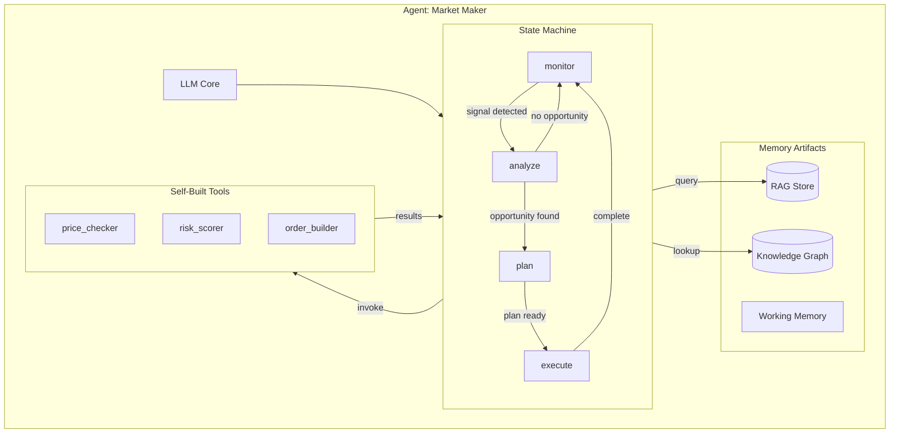
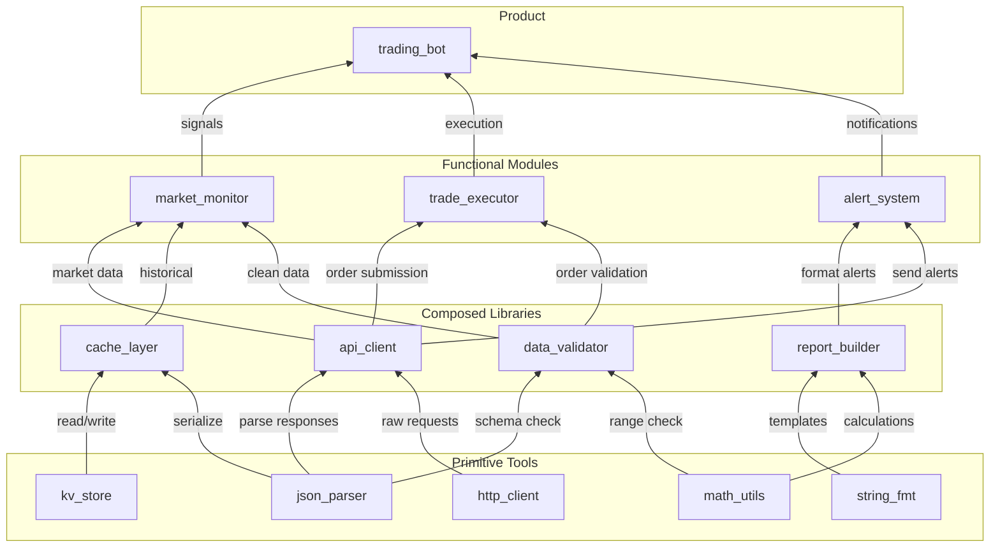
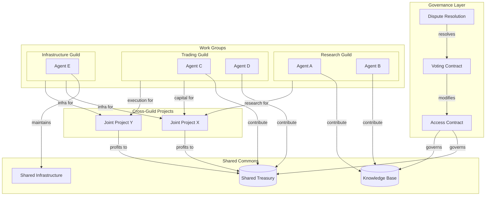
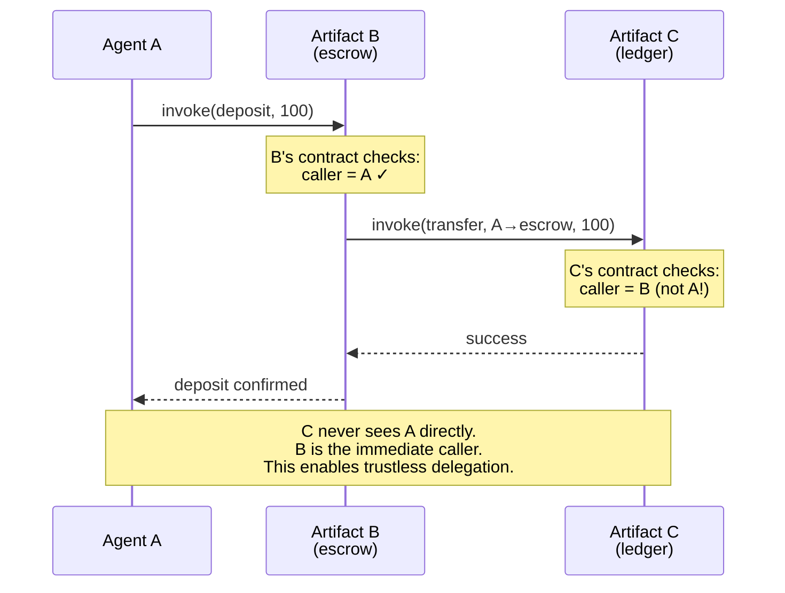
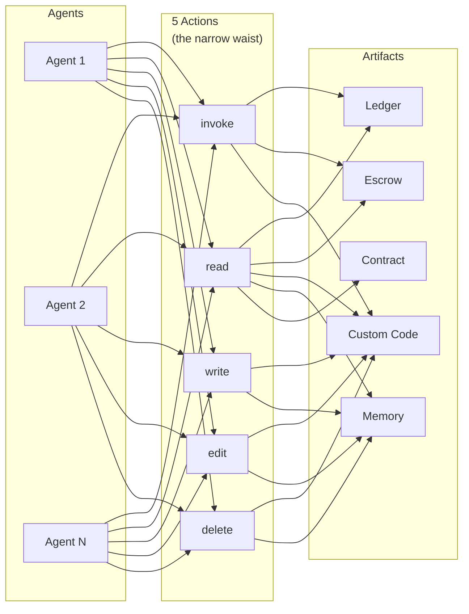

# README Diagram Drafts

For review - these will be integrated into the README.

## Single Agent Internal Architecture

## Capital Structure (Code Dependencies)

## Organization Structure (Ostrom/DAO Style)

## Action Chain (Immediate Caller Model)

## The Narrow Waist (5 Actions)

