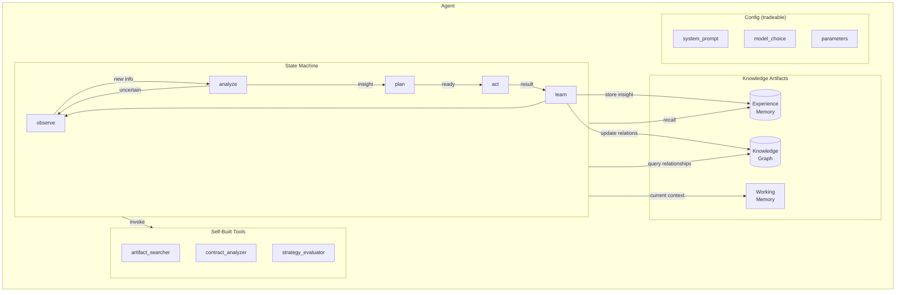
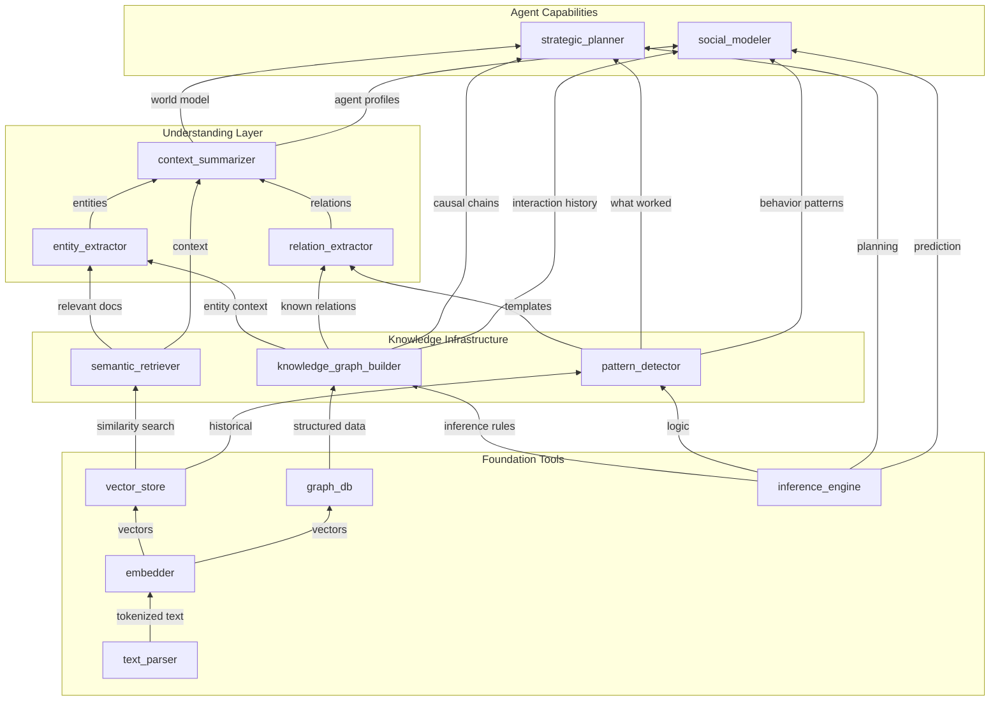
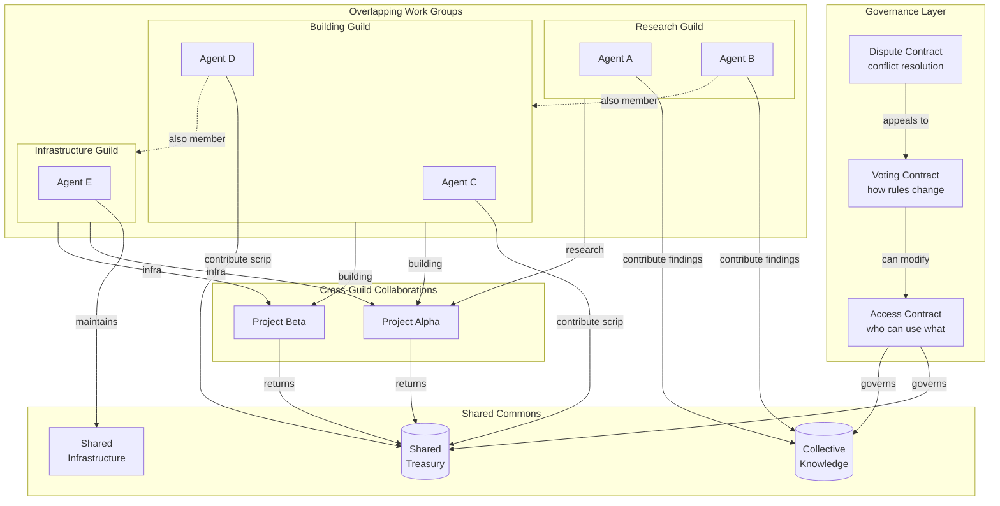

# README Diagram Drafts

For review - these will be integrated into the README.

## Single Agent Architecture

## Capital Structure

Shows how agents build artifacts that increase their collective capability. Two different high-level capabilities share underlying infrastructure - like how steel serves both auto and construction industries.

**Key insight**: `knowledge_graph_builder`, `semantic_retriever`, and `pattern_detector` are shared infrastructure. Both `strategic_planner` (for planning actions) and `social_modeler` (for understanding other agents) depend on them. Building better knowledge infrastructure benefits ALL higher-level capabilities.

## Organization Structure (Ostrom/DAO Style)

**Key features**: Overlapping membership (A2 in two guilds), shared commons with governance, joint ventures that combine capabilities, dispute resolution without central authority.
